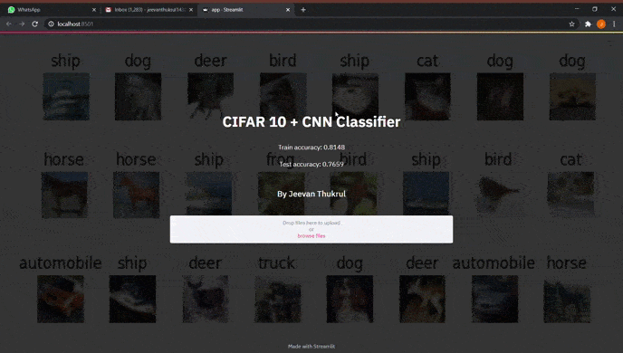

# Image-Classification-CIFAR10-with-CNN-dataset-GUI-Streamlit

## App Output



## Training and Testing Accurcy
Train accuracy: 0.8148
Test accuracy: 0.7659


## Project overview
- The aim of this project is to develop a model for Image classification and integrate it with the GUI, 
i.e., a model that classifies the input images based on CIFAR 10 using Convolutional Neural Networks.

## Folders and Files Description


### CIFAR10_Testing
- This contains images from the internet.
- Our model will be tested using this unseen data from the internet.

### Output
- Contains the App's final output 

### CNN_CIFAR10.ipynb
- Google Colab Notebook
- It is the python notebook used to build and save the model.

## Files for our Streamlit App

#### classify.py
- get_model(): Loads the saved model into cache using streamlit's "@st.cache" feature.
- predict(): Takes an image as input from the function parameter, preprocesses it and feeds it to the model for results.

#### app.py
- Contains the front-end code for the streamlit app.
- Imports the predict() function fetches the result and displays it.

### To run it on your system
- Install all the dependencies
- Clone this repository
- You need the Streamlit App folder to run this application.
- In your Command line/Terminal go to the directory file then type
 
```
 streamlit run app.py
```
